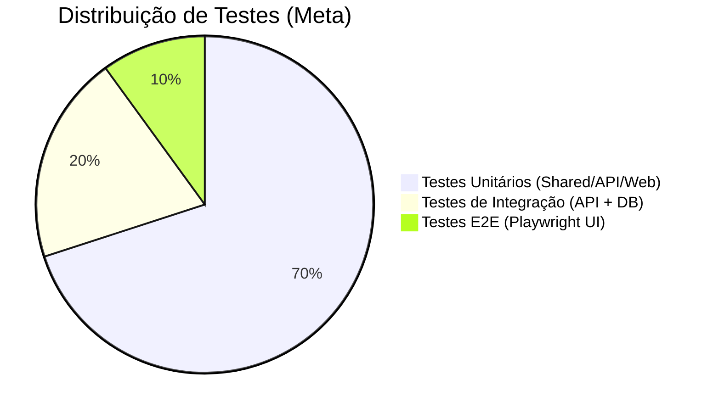

# Estratégia de Testes - AVANTE

Este documento descreve a arquitetura e estratégia de testes automatizados do projeto AVANTE. O objetivo principal é garantir estabilidade e evitar regressões enquanto o produto evolui para a V1 e começa a receber usuários reais.

## Pirâmide de Testes Implementada

Nossa estratégia adota uma pirâmide de testes onde a maioria dos testes são unitários (rápidos e isolados), seguidos de testes de integração (validação de banco e fluxo) e finalmente testes de ponta-a-ponta (E2E) simulando a jornada real do usuário.

---

## 1. Testes Unitários

### Core / Cálculos (`packages/shared`)
- **Ferramenta:** Vitest
- **O que testamos:** Toda a lógica financeira do arquivo `pricing.ts`, incluindo `calculatePrice`. Garantimos 100% de cobertura nesse arquivo crítico para não haver erros de precificação ou margens irreais.

### Backend (`apps/api`)
- **Ferramenta:** Vitest + `@nestjs/testing`
- **O que testamos:** Serviços (`ProductsService`, `AuthService`, `DashboardService`, etc) injetando mocks do `PrismaService` e validando o comportamento lógico sem tocar no banco de dados.

### Frontend (`apps/web`)
- **Ferramenta:** Vitest + `@testing-library/react` (JSDOM)
- **O que testamos:** Utilitários puros (como a configuração de `apiFetch`), gerenciadores de estado Zustand (`authStore`, `appStore`) e componentes puros de interface (como `EmptyState`).

---

## 2. Testes de Integração (API + Banco de Dados)

Os testes de integração rodam no backend para garantir que as rotas da API se comunicam corretamente com o banco de dados e os middlewares (autenticação, formatação de dados).

- **Ferramenta:** Vitest + Supertest
- **Ambiente:** Utilizamos um banco PostgreSQL separado (instanciado via `docker-compose.test.yml`) nomeado `avante_test` rodando na porta `5433`.
- **Setup:** O script de teste de integração executa o comando `prisma db push` antes dos testes para espelhar as tabelas, depois roda os testes de requisições HTTP batendo nos Controllers reais. 

---

## 3. Testes End-to-End (E2E)

Esses testes são responsáveis por simular um usuário interagindo visualmente no navegador. 

- **Ferramenta:** Playwright
- **Localização:** `apps/e2e`
- **O que testamos:** O core flow do usuário: Cadastro -> Login -> Listar Produtos -> Abrir Modal -> Cadastrar Produto -> Visualizar Produto.
- **Ambiente:** O Playwright espera que o sistema já esteja rodando (`npm run dev` global ou script do Github Actions).

---

## 4. Integração Contínua (CI)

Adicionamos uma pipeline com Github Actions no arquivo `.github/workflows/ci.yml`.

Sempre que houver um Push ou Pull Request para a branch `main`, a pipeline irá automaticamente:
1. Instalar dependências (usando turbo)
2. Subir um banco de dados de teste (Service Postgres)
3. Rodar `turbo run lint`
4. Rodar testes unitários e de integração (`turbo run test` e `test:e2e`)
5. Levantar o Frontend e a API
6. Executar o Playwright e fazer upload do relatório.

---

## Como rodar localmente

- **Todos os testes unitários da Monorepo:** 
  `npm run test` (na pasta raiz)

- **Testes de integração da API:** 
  `cd apps/api && npm run test:e2e`

- **Cobertura de testes no Frontend:**
  `cd apps/web && npm run test:coverage`

- **Playwright E2E UI:**
  `cd apps/e2e && npm run test:ui` (Certifique-se de que a API e o WebApp estejam rodando antes em outro terminal)
